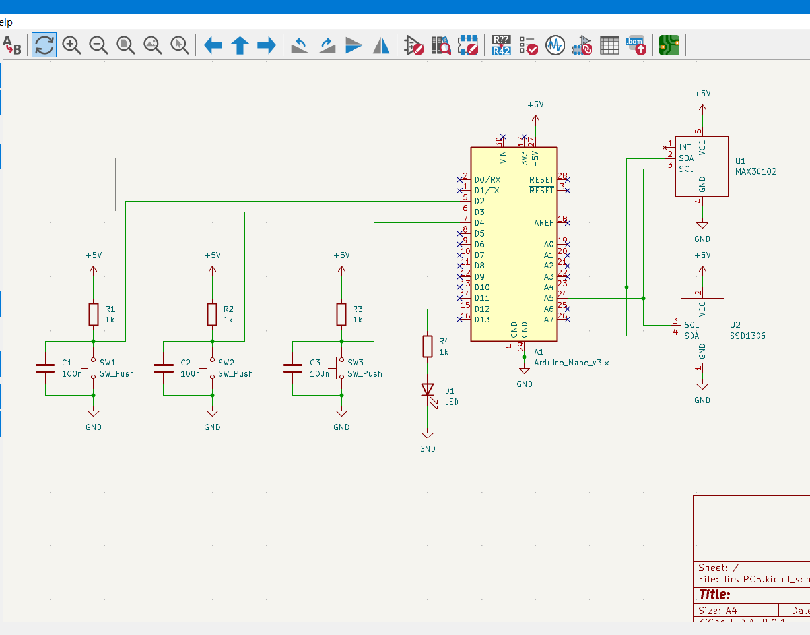
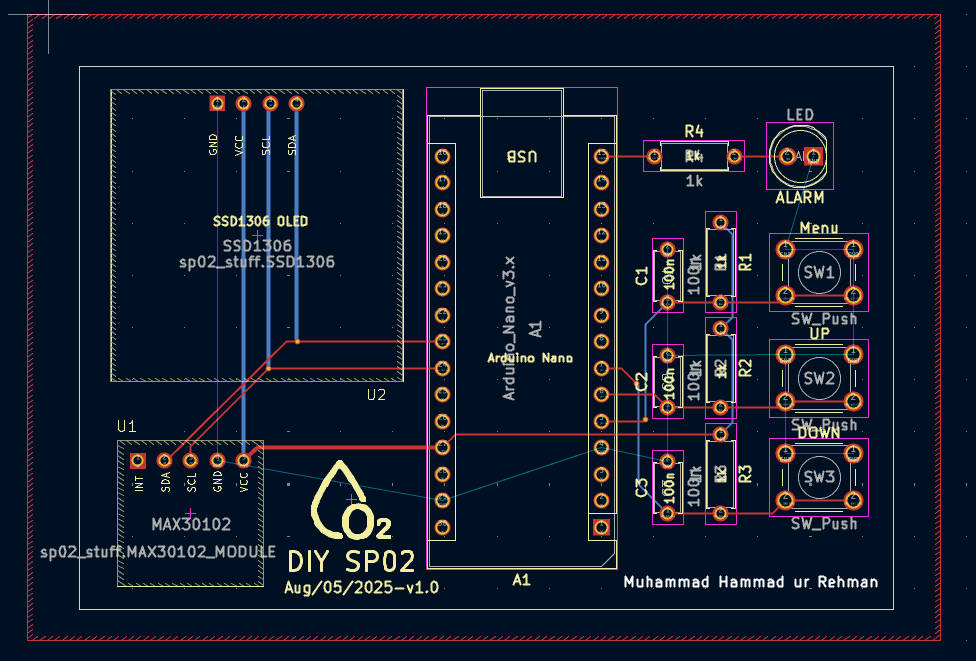
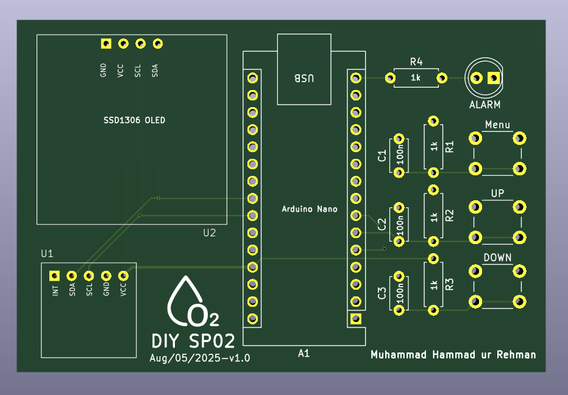
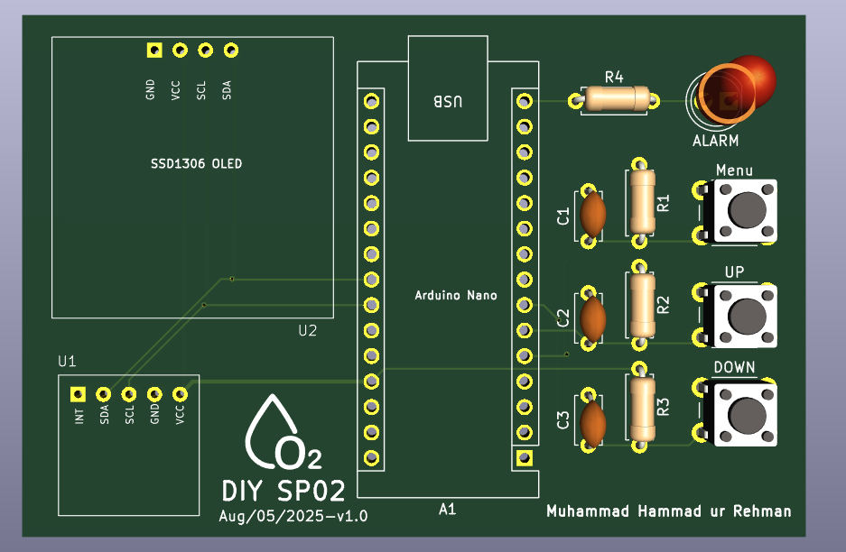

# SP02 Monitoring PCB – First Custom Project 💻🔬

This is my first custom PCB project — a compact **SP02 Monitoring Device** built using:

- ✅ **MAX30102** – Pulse oximeter and heart rate sensor  
- ✅ **SSD1306 OLED Display** – For real-time oxygen and pulse display  
- ✅ **Arduino Nano** – Acts as the main controller  
- ✅ **KiCad 9.0** – Used for schematic, layout, and Gerber generation  

---

## 🛠 Features

- Live display of SPO2 and heart rate on OLED
- Compact 2-layer PCB layout
- Custom footprints and symbols designed in KiCad
- Beginner-friendly open-source hardware

---

## 📂 Project Files

- `sp02_monitor.kicad_sch` → Complete schematic  
- `sp02_monitor.kicad_pcb` → PCB layout  
- `sp02-stuff.pretty/` → Custom footprint folder  
- `sp02-stuff.kicad_sym` → Custom symbol library  
- `gerbers/` → Fabrication-ready Gerber files

---

## 🧠 What I Learned

- Creating and managing schematics  
- Designing custom footprints and parts  
- PCB routing and layout techniques  
- Generating Gerber files for manufacturing  
- Understanding real-world size & placement constraints

---

## 📸 Preview

### 🔷 Schematic

### 🔷 PCB Layout

### 🔷 PCB

---

## 🧪 Status

✅ Design Complete  
🛠️ Currently waiting for fabrication  

---

## 🔗 License

This project is open-source and available under the MIT License.

---

> If you use or improve this design, feel free to contribute or give a ⭐️ on GitHub!

