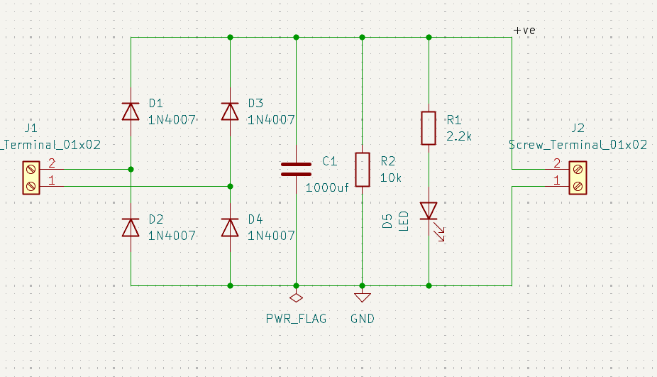
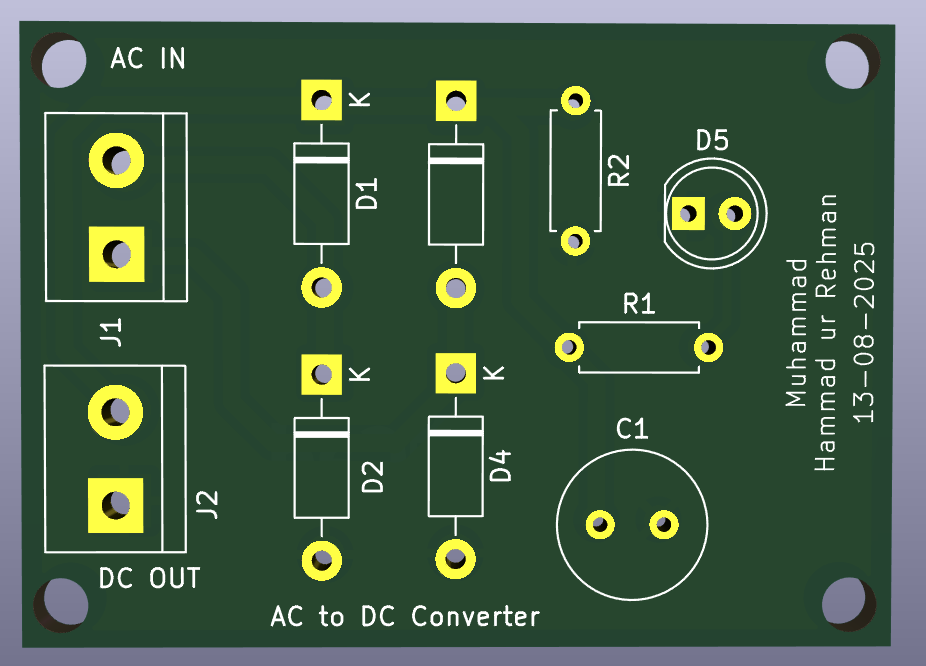
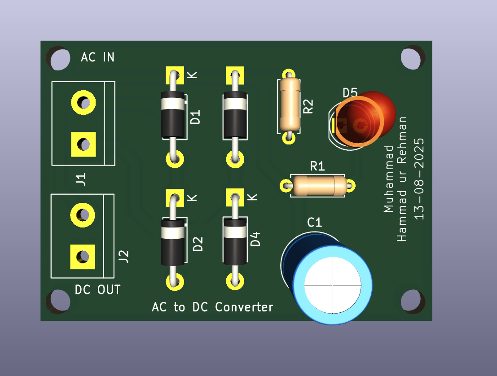
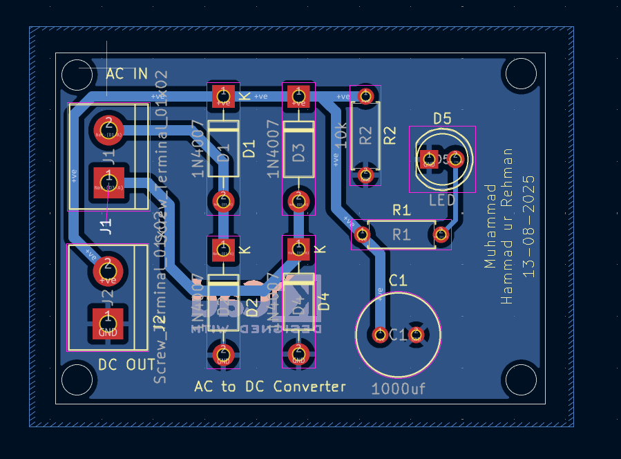

# Day 1 – AC to DC Converter (PCB Design)

This is **Day 1** of my **10-Day PCB Design Challenge**, where I design PCB projects starting from simple circuits and gradually moving towards more complex ones.

For today’s design, I created a **single-layer PCB** for an **AC to DC Converter** using **KiCad**.

---

## 📜 Project Overview
The circuit converts AC voltage to DC using:
- **4 × Diodes** (Bridge Rectifier)
- **2 × Resistors**
- **1 × Capacitor**
- **1 × LED** (Output indicator)

---

## 🛠 Tools Used
- **KiCad** for schematic and PCB layout
- **GitHub** for version control

---

## 📂 Files in This Project
- **`schematic.png`** – Circuit schematic
- **`board.png`** – PCB front view
- **`boardC.png`** – PCB with components
- **`layout.png`** – PCB layout view

---

## 📸 Project Images

### Schematic

### PCB Board

### PCB with Components

### Layout

---

## 📅 Challenge Context
This project is part of my **10-Day PCB Design Challenge**:
- **Goal:** Improve PCB design skills from basic to complex designs
- **Day 1:** AC to DC Converter (Single Layer PCB)

---

## 📬 Repository Info
- **Folder Name:** `02_ac_to_dc_converter`
- **Author:** Muhammad Hammad ur Rehman
- **License:** Open for learning and educational purposes

---

## 🔗 Connect with Me
[LinkedIn](https://www.linkedin.com/in/mhammadurrehman) • [GitHub](https://github.com/hammadurrehman2006)
