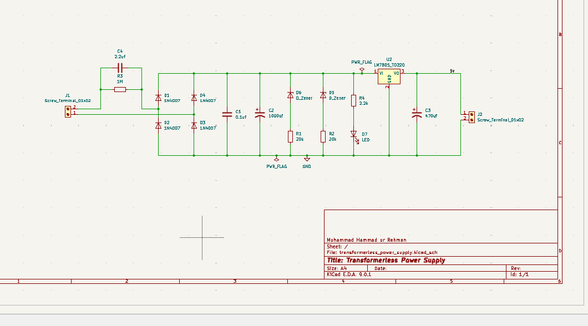
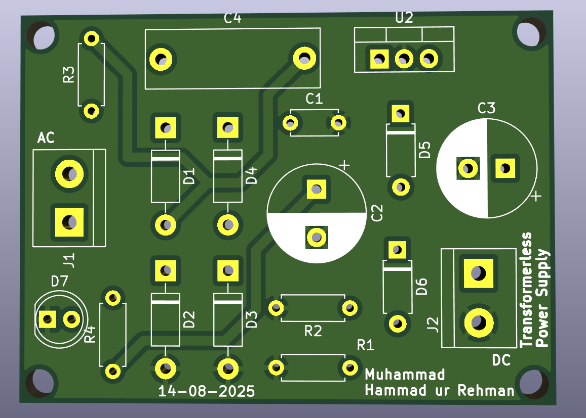
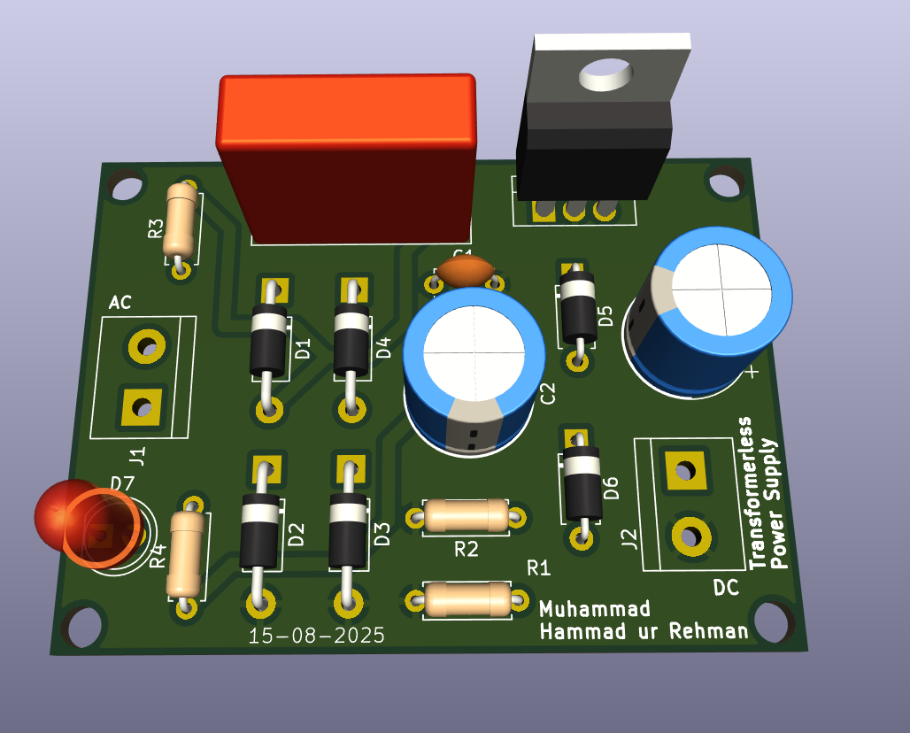
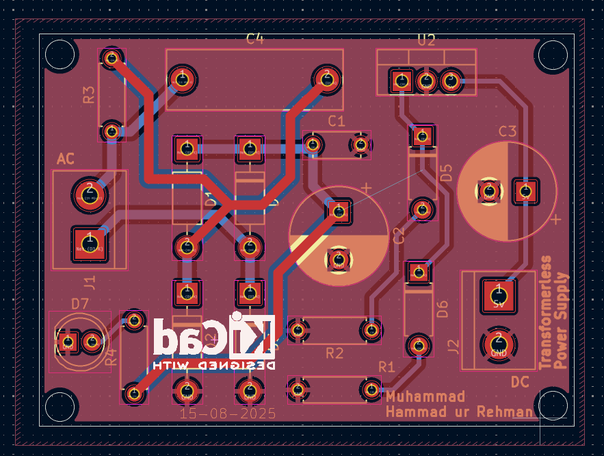

# Day 2 – Transformerless Power Supply (PCB Design)

This is **Day 2** of my **10-Day PCB Design Challenge**, where I design PCB projects starting from simple circuits and gradually moving towards more complex ones.

For today’s design, I created a **2-layer transformerless power supply PCB** using **KiCad**.

---

## 📜 Project Overview
This PCB converts AC to a regulated DC output using common components.  
The circuit includes:
- **2 × Capacitors**
- **2 × Polarized Capacitors**
- **4 × Diodes**
- **2 × Zener Diodes**
- **LM7805 Voltage Regulator**
- **4 × Resistors**
- **1 × LED**
- **2 × 2-Pin Screw Terminals**

---

## 🛠 Tools Used
- **KiCad** for schematic and PCB layout  
- **GitHub** for version control  

---

## 📂 Files in This Project
- **`schematic.png`** – Circuit schematic  
- **`board.png`** – PCB front view  
- **`boardC.png`** – PCB with components  
- **`layout.png`** – PCB layout view  

---

## 📸 Project Images

### Schematic

### PCB Board

### PCB with Components

### Layout

---

## 📅 Challenge Context
This project is part of my **10-Day PCB Design Challenge**:
- **Day 1:** AC to DC Converter (Single Layer PCB)  
- **Day 2:** Transformerless Power Supply (2-Layer PCB)  

---

## 📬 Repository Info
- **Folder Name:** `03_transformerless_pwr_supply`  
- **Author:** Muhammad Hammad ur Rehman  
- **License:** Open for learning and educational purposes  

---

## 🔗 Connect with Me
[LinkedIn](https://www.linkedin.com/in/mhammadurrehman) • [GitHub](https://github.com/hammadurrehman2006)  
