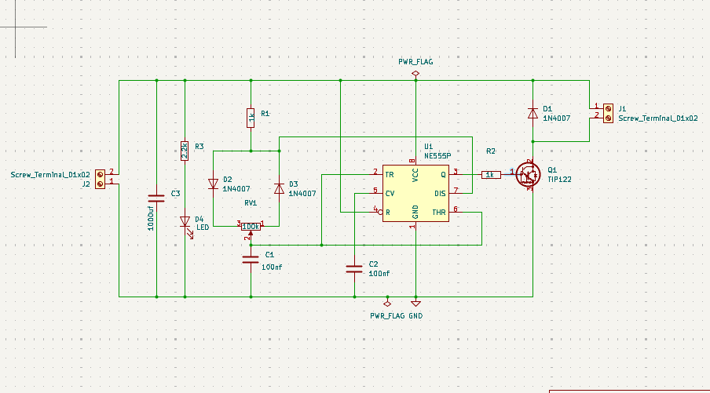
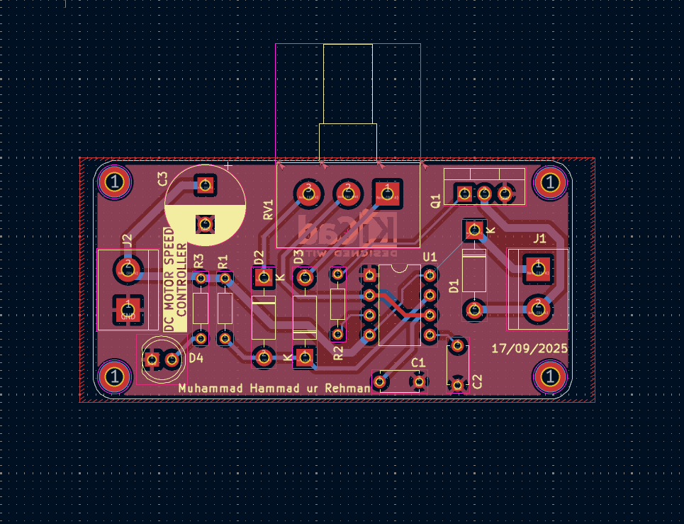
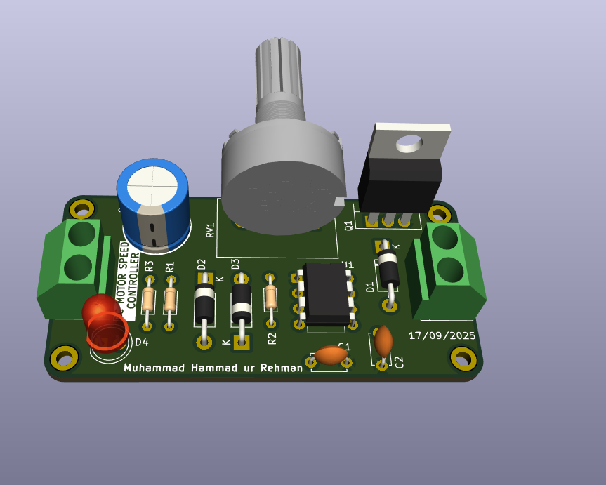
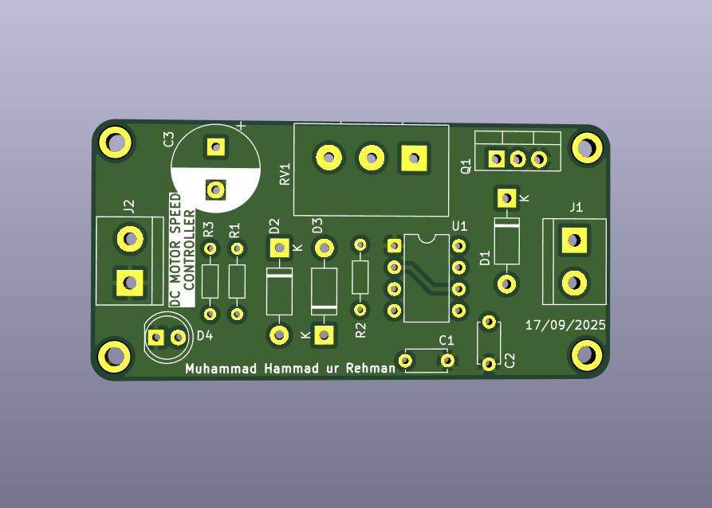

# Day 4 – DC Motor Speed Controller (PCB Design)

This is **Day 4** of my **10-Day PCB Design Challenge**.  
For today’s project, I designed a **DC Motor Speed Controller PCB** using **KiCad**.  
The circuit is based on a **555 Timer IC** in astable mode, generating PWM to control motor speed via a transistor.

---

## 📜 Project Overview
The circuit includes:
- **1 × Potentiometer** (for speed adjustment)  
- **1 × 555 Timer IC**  
- **2 × Capacitors**  
- **3 × Resistors**  
- **1 × Power Transistor (Q1)**  
- **3 × Diodes**  
- **1 × LED** (status indicator)  
- **2 × 2-Pin Screw Terminals** (power in, motor out)

---

## 🛠 Tools Used
- **KiCad** for schematic and PCB layout  
- **GitHub** for version control  

---

## 📂 Files in This Project
- **Schematic & PCB files** (KiCad project)  
- **Gerber files** for fabrication  
- **Drill files** (included inside Gerbers folder)  
- **Images** for quick preview in this README  

---

## 📸 Project Images

### Schematic

### PCB Layout

### PCB with Components

### PCB Board

---

## 📬 Repository Info
- **Folder Name:** `05_dc_motor_speed_controller`  
- **Author:** Muhammad Hammad ur Rehman  
- **License:** Open for learning and educational purposes  

---

## 🔗 Connect with Me
[LinkedIn](https://www.linkedin.com/in/mhammadurrehman) • [GitHub](https://github.com/hammadurrehman2006)  
