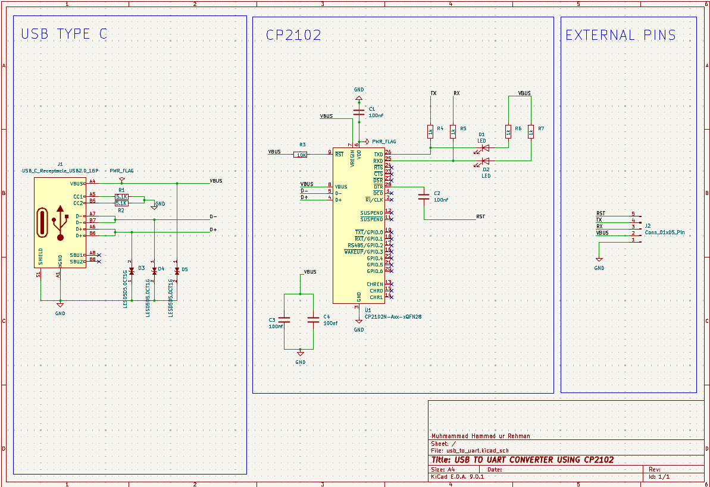
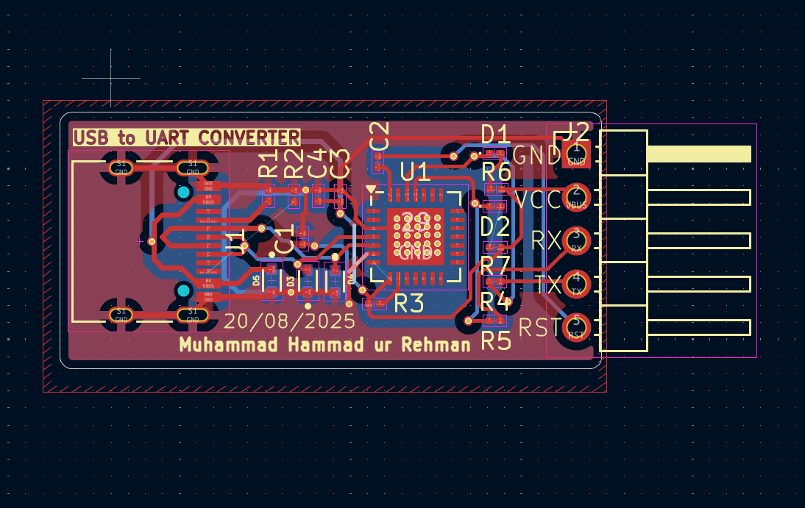
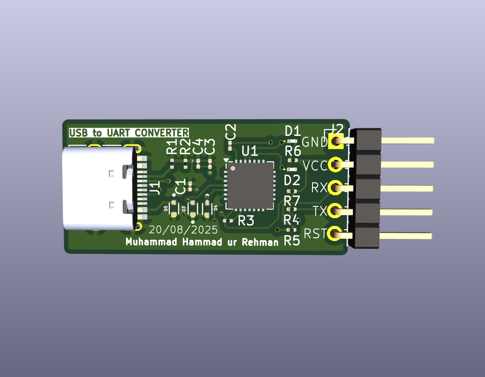
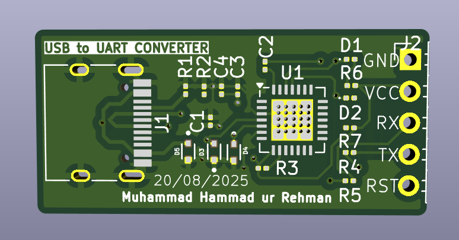

# Day 5 – USB to UART Converter (CP2102)

This is **Day 5** of my **10-Day PCB Design Challenge**.
After getting delayed due to heavy rain 🌧️ on 19th Aug, I’m back with my next project – a **USB to UART Converter PCB** designed using **KiCad**.

This project is special because it’s my **first SMD-based PCB design** 🎉 and also introduces **vias** and **ESD protection** for improved reliability.

---

## 📜 Project Overview

The circuit is based on the **CP2102 USB-to-UART Bridge Controller**, which enables easy communication between a computer’s USB port and microcontrollers or other UART-based devices.

### Key Features:

* **USB Type-C input**
* **CP2102 IC (SMD package)**
* **ESD protection diodes** → *LESD5D5.0CT1G*
* **LED indicators** for Power, TX, and RX
* **Decoupling capacitors** for noise reduction
* **External pins** (VCC, GND, TX, RX, RST) for easy interfacing
* **Vias** for better routing on the 2-layer PCB

---

## 🛠 Tools Used

* **KiCad** → Schematic & PCB Design
* **GitHub** → Version control & documentation

---

## 📂 Files in This Project

* **Schematic & PCB files** (KiCad project)
* **Gerber files** (for fabrication)
* **Drill files**
* **Images** (schematic, PCB layout, 3D preview)

---

## 📸 Project Images

### Schematic

### PCB Layout

### 3D PCB Preview

### 3D PCB without components Preview

---

## 📬 Repository Info

* **Folder Name:** `06_usb_to_uart`
* **Author:** Muhammad Hammad ur Rehman
* **License:** Open for learning & educational purposes

---

⚡ This project marks a milestone for me as I move from **through-hole designs** to **SMD-based PCBs** while also learning to use **vias** and **protection circuits** in real-world designs.

---

