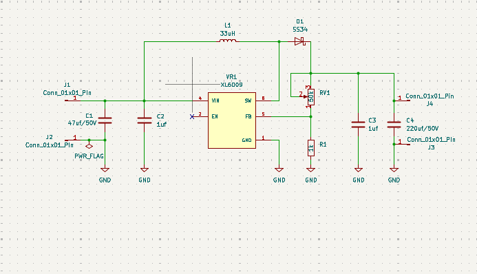
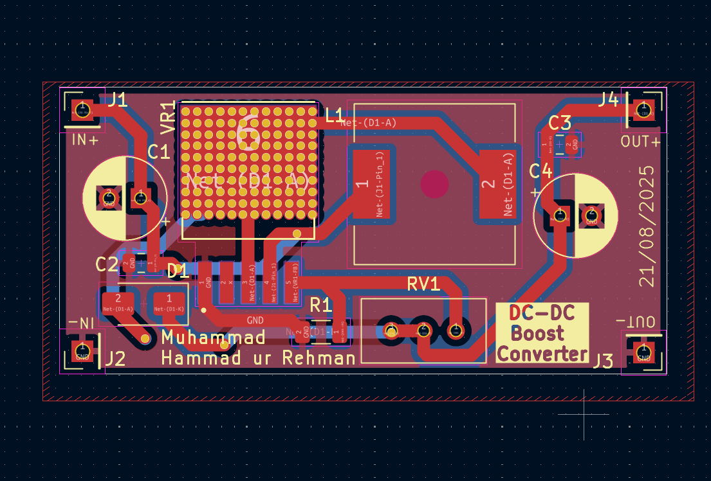
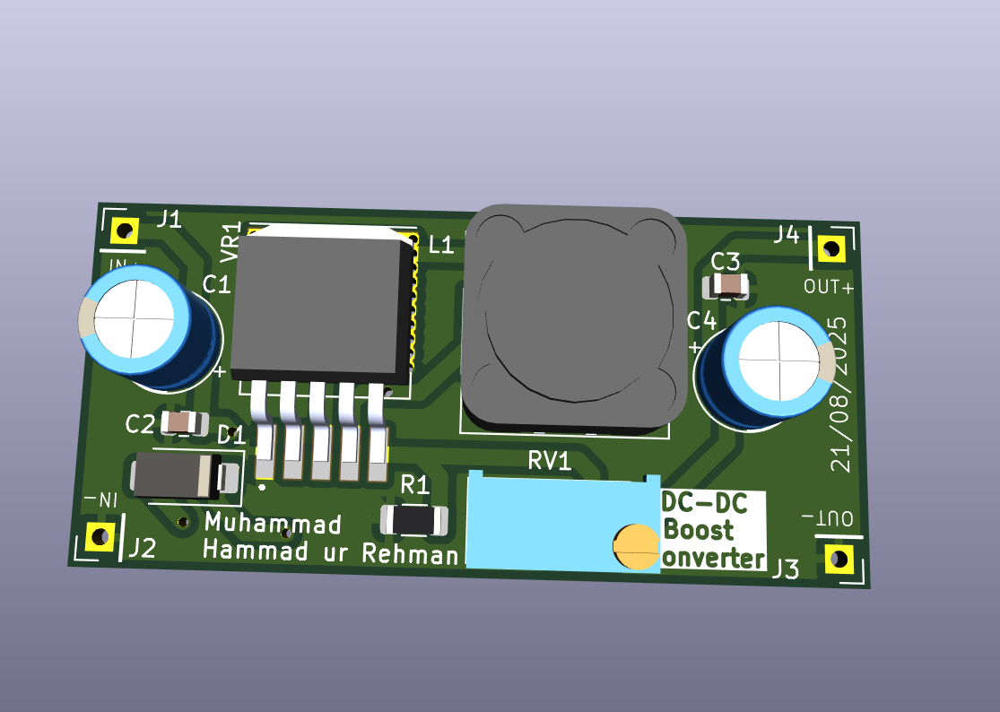
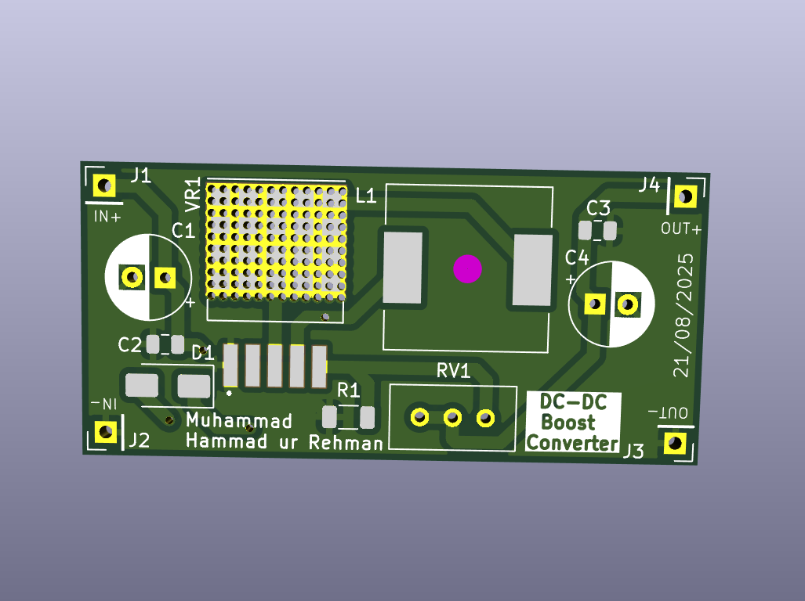

# Day 6 – Boost Converter (XL6009)

This is **Day 6** of my **10-Day PCB Design Challenge**.
Today, I designed a **Boost Converter** circuit using the **XL6009 regulator IC** in KiCad.

A boost converter is a **DC-DC step-up regulator** that efficiently converts a lower input voltage into a higher output voltage, making it useful in power supply applications where the input source is lower than the required load voltage.

---

## 📜 Project Overview

This design uses the **XL6009 boost regulator IC** with supporting components to provide a stable adjustable output.

### Key Components:

* **XL6009 Regulator IC** (step-up DC-DC converter)
* **Inductor (33µH)** for energy storage
* **Schottky diode (SS34)** for rectification
* **Capacitors**:

  * Input → 47µF/50V + 1µF
  * Output → 220µF/50V + 1µF
* **Potentiometer (RV1)** to adjust output voltage
* **Resistor (R1)** for feedback reference
* **Connectors** for input & output terminals

---

## 🛠 Tools Used

* **KiCad** → Schematic & PCB Design
* **GitHub** → Version control & documentation

---

## 📂 Files in This Project

* **Schematic & PCB files** (KiCad project)
* **Gerber files** (for fabrication)
* **Drill files**
* **Images** (schematic, PCB layout, 3D preview)

---

## 📸 Project Images

### Schematic

### PCB Layout

### 3D PCB Preview

### 3D PCB Preview without Components

---

## 📬 Repository Info

* **Folder Name:** `07_dc_boost_converter`
* **Author:** Muhammad Hammad ur Rehman
* **License:** Open for learning & educational purposes

---

⚡ With this boost converter, I can efficiently step up DC voltages — making it ideal for powering devices that require higher voltages from lower-voltage sources.

---

