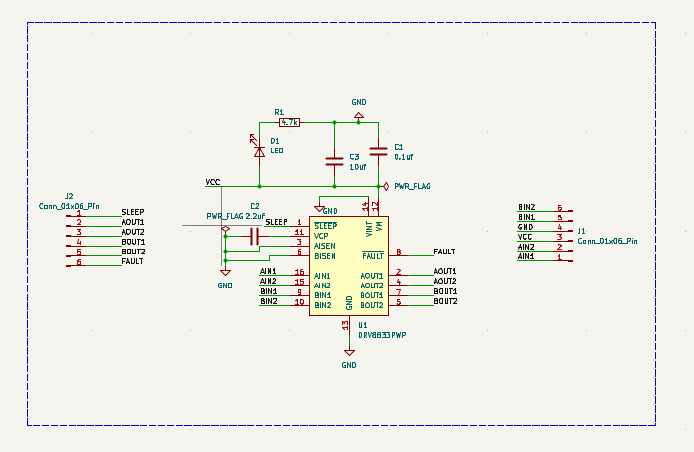
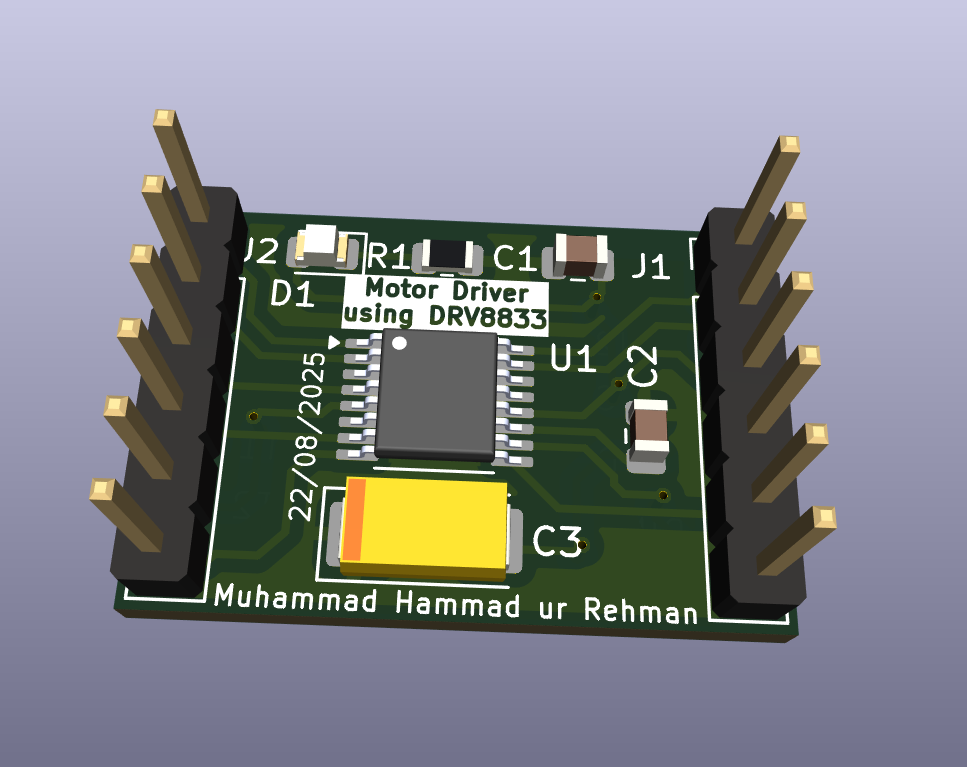
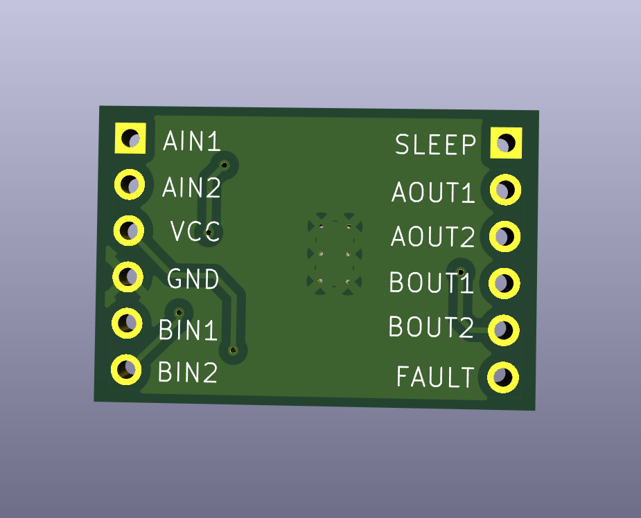

# Day 7 – Motor Driver (DRV8833)

This is **Day 7** of my **10-Day PCB Design Challenge**.
For today’s project, I designed a **Motor Driver PCB** using the **DRV8833 dual H-Bridge IC** in KiCad.

The **DRV8833** is a highly efficient motor driver capable of driving two DC motors or a single stepper motor, making it ideal for robotics and automation projects.

---

## 📜 Project Overview

This design allows for **bidirectional control** of two DC motors with PWM speed control.

### Key Features:

* **DRV8833 IC** (dual H-bridge motor driver)
* Supports **2 × DC motors** or **1 × stepper motor**
* **PWM control** for motor speed
* **Overcurrent & thermal protection** (built-in by DRV8833)
* **Input/output connectors** for easy interfacing
* Compact **2-layer PCB** design

---

## 🛠 Tools Used

* **KiCad** → Schematic & PCB Design
* **GitHub** → Version control & documentation

---

## 📂 Files in This Project

* **Schematic & PCB files** (KiCad project)
* **Gerber files** (for fabrication)
* **Drill files**
* **Images**:

  * `schematic.png` → Circuit schematic
  * `layout.png` → PCB layout
  * `boardC.png` → Front side (with components)
  * `boardB.png` → Back side

---

## 📸 Project Images

### Schematic

### PCB Layout

### PCB Front (Components Side)

### PCB Back

---

## 📬 Repository Info

* **Folder Name:** `08_motor_driver_with_DRV8833`
* **Author:** Muhammad Hammad ur Rehman
* **License:** Open for learning & educational purposes

---

⚡ With this motor driver, I can drive small robots, automation projects, or stepper-based systems with precise speed and direction control.

---
